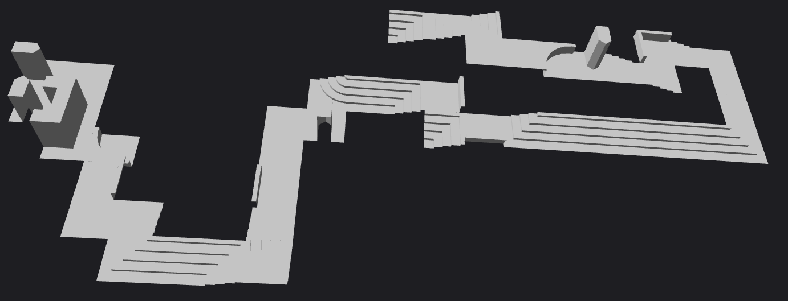
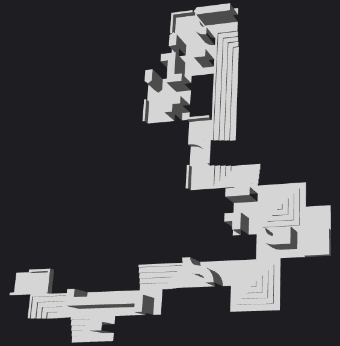
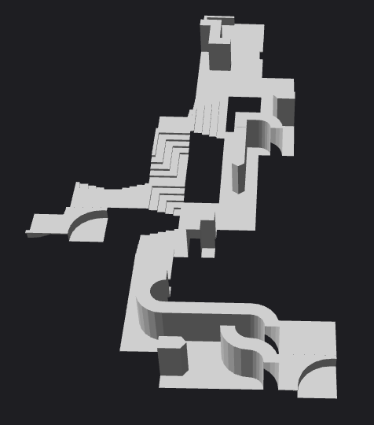
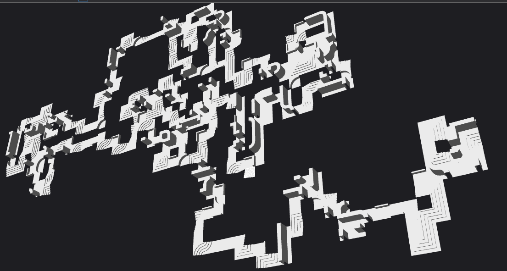
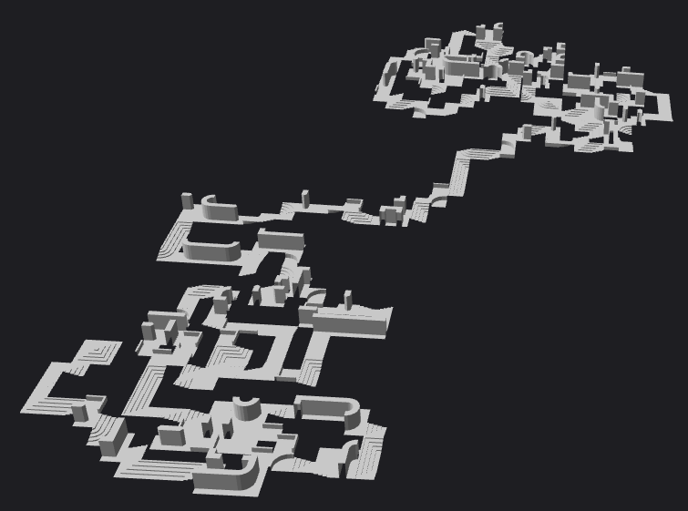

# Dungeon Generator

## Brief
Given a single FBX file with dungeon tiles, build a series of random dungeons.

## Introduction
For the dungeon generator we will use Python and Autodesk's FBX SDK to generate a random dungeon using components taken from a single FBX file. The same components can be used to generate multiple layouts of the dungeon. Dummy objects and tags were used as connectors between the components and to determine which components were compatible to be connected.

## Objectives
Our objectives for this project is to create a working dungeon generator that also has a web interface to view the generated dungeon.

## The Autodesk FBX SDK
The Autodesk FBX SDK allows us to import the components file into the program and manipulate the meshes. The SDK also allows use to export the dungeon and store it in its own FBX file. Although it's a C++ based SDK, Autodesk provides one with python bindings. Which will be useful in developing a program faster.

## The Components File
This contains all the components that can be used to make the dungeon. These arranged as tiles so that it would be easier to fit them together. Because the FBX file stores their meshes in a tree like structure we can add connectors that belong to each tile. Using them would identify which tile they belong to if we set them as a child of the tile. This can be further extended by the use of tags for the tile and the connectors. The tags on the connectors can determine compatible tiles with the same tags on their own connectors. This is all done in Blender where it's possible to do such things.

## The Dungeon Generator
The program is written in Python and using the Python FBX SDK from Autodesk, the FBX file is read into the program and the information about the components are stored into some data structures. Information about the tiles, the incoming connectors and the outgoing connectors are stored into dictionaries to be used in the rest of the program. The regular expressions module is used to determine whether a connector is incoming or outgoing and to determine the type of connector it is.

After loading the tile and connector information into the program, we use the FBX SDK to create a scene to create the dungeon. The create\_dungeon() function takes in the scene and a starting tag from which to construct the dungeon. Within the create\_dungeon() function, the stored tile information is cloned into tile\_meshes and the starting position and angle of the dungeon is initialised. The random number generator and todo list is initialised at this point as well. The todo list contains a tuple of the position, angle, outgoing tag name and incoming tag name of the current edge.

The tile comparison code is run in a while loop that runs as long as there are edges in the todo list and the number of tiles on the scene is below a set number. Here, the position, angle, outgoing tag name and incoming tag name are taken out of the todo list and put through the try\_tile() function. The incoming connectors list is constrained to the outgoing tag name and the In\_sel variable is randomly selected within the range of the incoming connectors list before being pushed into try\_tile() as well.

In the try\_tile() function the tag name, tile name, position and angle of the connector is taken from the incoming list. The specific connector is selected by the in\_sel variable that was determined by the random number generator in the previous function. The information passed into try\_tile is used to set the name and position of the tile next to the initial edge. There is a check to see if any existing edges fit the tile and all the outgoing edges is added to the todo list. Edge positions are checked if they exist in the Edges list and if they don't then they are added in along with the being added into the todo list. By the end of the function, the tile that was checked is made into a node in the scene. 

Once the program finishes going through the while loop, an exporter is created and the scene is saved into a resulting FBX file. The exporter is destroyed and the program ends with a new FBX file containing the new dungeon.

## The Resulting Dungeons
The following examples are of the dungeon creation process limited to 50 tiles. Because the starting selection for the incoming connector is random, this changes the tiles that follow.

The disadvantage of doing it this way is that there is basically one path through out the map and some components have walls that obstruct the would-be player's progress.

One way we could improve the generation is to somehow bias the generation to favour the flat 2x2 tiles so that rooms would be built in the process. Or save the wall components until a second pass of map generation to find all the components left unconnected.

The following examples are for dungeons that are generated with a limit of 500 tiles.

The problem is more pronounced in these maps, showing massive gaps between tiles and having more or less one path through the level.

